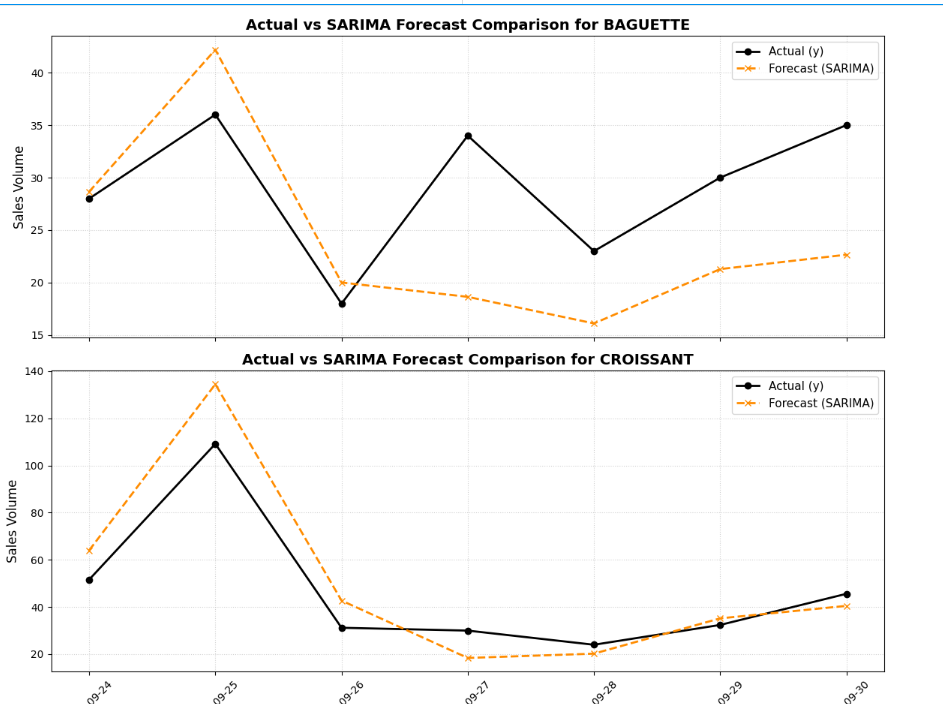
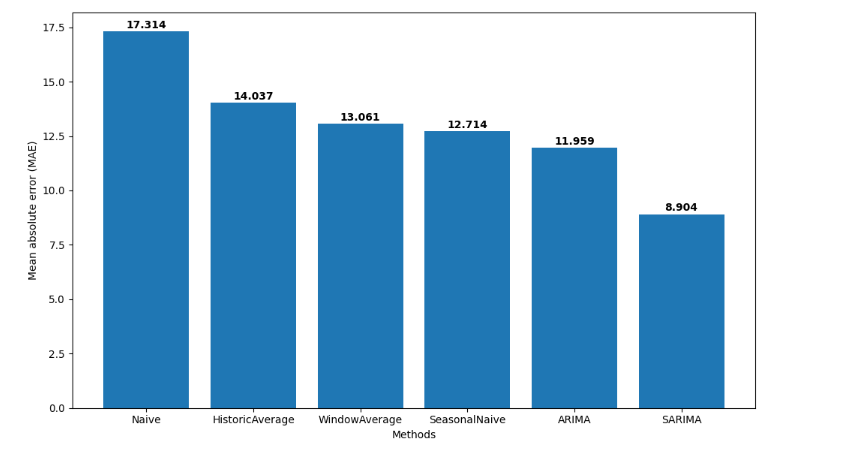
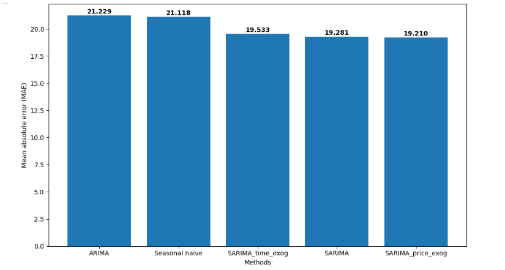

# 🍞 French Bakery Daily Sales Forecasting

Predicting daily sales volume for bakery items (such as **BAGUETTE** and **CROISSANT**) using statistical time series models powered by Nixtla's `statsforecast` and `utilsforecast`.

---

## 📌 Business Overview
Accurate daily sales forecasting helps bakery owners and managers:
* **Optimize Inventory:** Prevent stockouts of high-demand items.
* **Reduce Waste:** Minimize leftover perishable products at the end of the day.
* **Schedule Production:** Plan baking volume efficiently based on historical trends.

---

## 📊 Dataset Information
* **Dataset File:** `daily_sales_french_bakery.csv`
* **Historical Scope:** Daily transaction records covering 121 unique bakery items.
* **Key Columns:**
  * `unique_id`: Bakery product identifier (e.g., `BAGUETTE`, `CROISSANT`).
  * `ds`: Transaction date.
  * `y`: Daily sales volume.
  * `unit_price`: Unit price per item (retained for future price elasticity analysis).

---

## 🛠️ Installation & Setup

1. **Clone the repository:**
   ```bash
   git clone [https://github.com/](https://github.com/)<User_của_bạn>/french-bakery-sales-forecasting.git
   cd french-bakery-sales-forecasting
   ```

2. **Install required dependencies:**
   ```bash
   pip install statsforecast utilsforecast matplotlib pandas numpy
   ```

3. **Run the Notebook:**
   Launch Jupyter Notebook or open the file in Google Colab to execute the analysis.

---

## 📈 Model Performance & Comparison





---

## 🤝 Acknowledgments
* Data & Library Source: [Nixtla StatsForecast](https://github.com/Nixtla/statsforecast)
